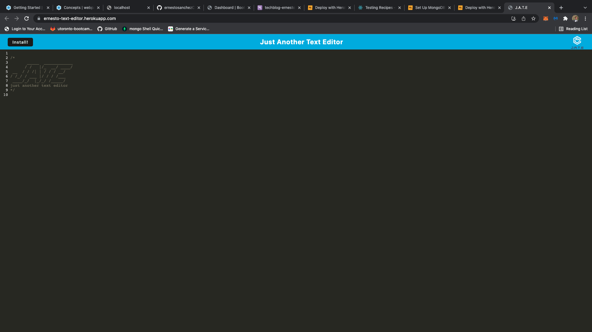
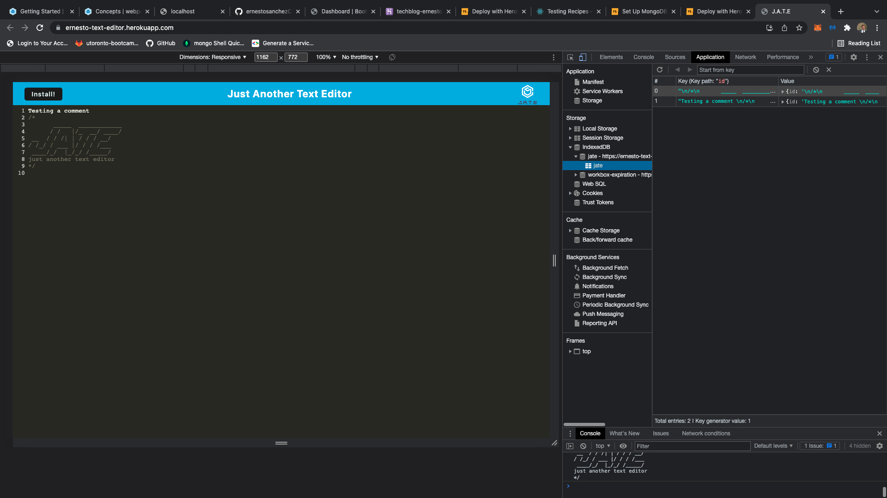
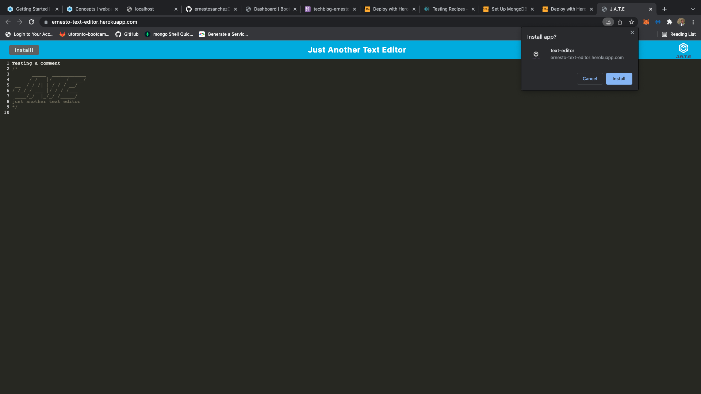

# Text Editor Using Progressive Web App (PWA) Technology

[](https://opensource.org/licences/MIT)

## Description

This app functions as a text editor that runs in the browser. The app is a single-page application that meets PWA criteria. Additionally, it features a number of data persistence techniques that serve as redundancy in case one of the options is not supported by the browser. This application also function offline.
This text editor implements methods for getting and storing data to a local IndexedDB database. Using a package called idb, which is a lightweight wrapper around the IndexedDB API. It features a number of methods that are useful for storing and retrieving data, and is used by companies like Google and Mozilla.
This full-stack application is deployed live to Heroku.

## Table of Contents

-   [User Story](#userstory)
-   [Screen Shots](#screenshots)
-   [Installation](#installation)
-   [Usage](#usage)
-   [License](#license)
-   [Contributing](#contributing)
-   [Tests](#tests)
-   [Questions](#questions)

## User Story

AS A developer
I WANT to create notes or code snippets with or without an internet connection
SO THAT I can reliably retrieve them for later use

## Screenshots





## Installation

This project uses npm packages:
In main directory terminal Enter the following commands :

```
npm i
```

```
npm run build
```

```
npm start
```

## Usage

To run tests, run the following command:

```

npm start

```

## License

    License is MIT standard license.

## Contributing

It is an open project and everyone can contribute - please send and email requesting to be added as a contributor

## Questions

If you have any questions about the repo, open an issue or contact [ernestosanchezCS](https://github.com/ernestosanchezCS/) directly at ernestosanchez8888@gmail.com.
